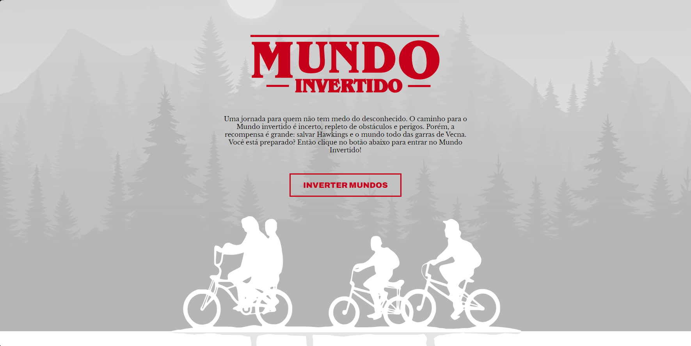

# DIO - Inverted World

Page with theme switcher using HTML, CSS and JavaScript, in addition to integrating a registration form with a Firebase database.

## Table of contents

- [Overview](#overview)
  - [The challenge](#the-challenge)
  - [Screenshot](#screenshot)
  - [Links](#links)
- [My process](#my-process)
  - [Built with](#built-with)

## Overview

### The challenge

Users should be able to:

- Preview the optimal layout for the website depending on your device's screen size
- Change theme as requested
- Listen to the music for the given theme
- Send a form with the information desired by the user

### Screenshot

  - Desktop
  
    

### Links

- Live Site URL: https://inverted-world-rafael.netlify.app

## My process

### Built with

- Semantic HTML5 markup
- CSS custom properties
- Flexbox
- CSS Grid
- Javascript properties

## Apoie

